# MySQL exercises

## 03: Single table select

### 1
SELECT * FROM goal;

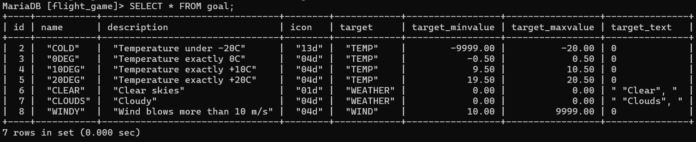

### 2
SELECT name, type 
FROM airport 
WHERE iso_country='FI';

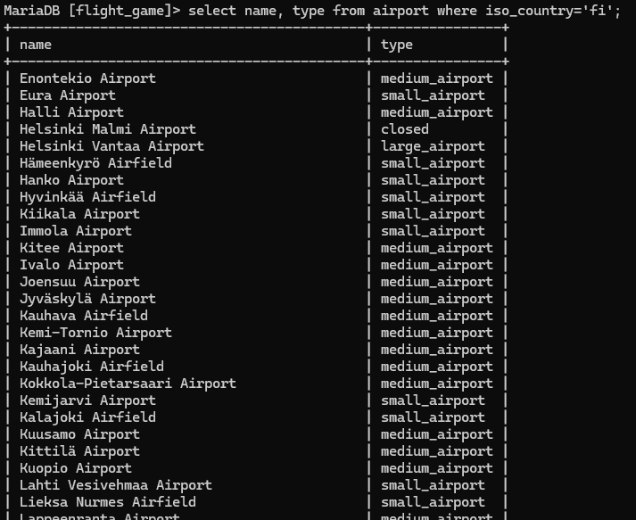

### 3
SELECT name
FROM airport
WHERE iso_country='FI'
ORDER BY name;

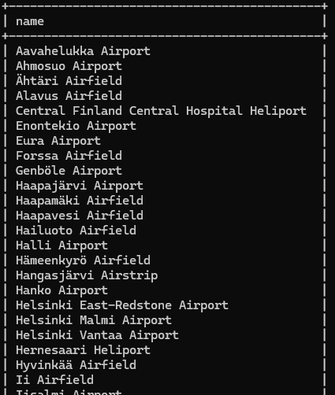

### 4
SELECT name, type
FROM airport
WHERE iso_country='FI'
ORDER BY type, name;

### 5
SELECT name
FROM country
WHERE name LIKE 'F%';

### 6
SELECT name
FROM country
WHERE name like '%f%';

### 7
SELECT location FROM game WHERE screen_name='Vesa';

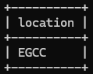

### 8
SELECT co2_consumed FROM game WHERE screen_name='Ilkka';

### 9
SELECT DISTINCT co2_budget FROM goal;

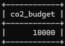

## 04: Where-clause select

### 1
SELECT country.name as "country name", airport.name as "airport name"\
FROM country\
JOIN airport on country.iso_country = airport.iso_country\
WHERE country.name='Iceland';

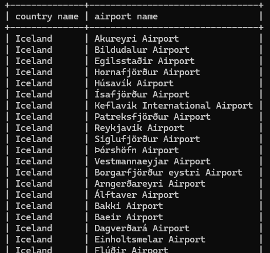

### 2
SELECT airport.name as "airport name"\
FROM country\
JOIN airport on country.iso_country = airport.iso_country\
WHERE country.name='France' AND airport.type='large_airport';

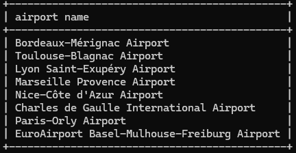

### 3
SELECT country.name as "country_name", airport.name as "airport_name"\
FROM country\
JOIN airport on country.iso_country = airport.iso_country\
WHERE airport.continent='AN';

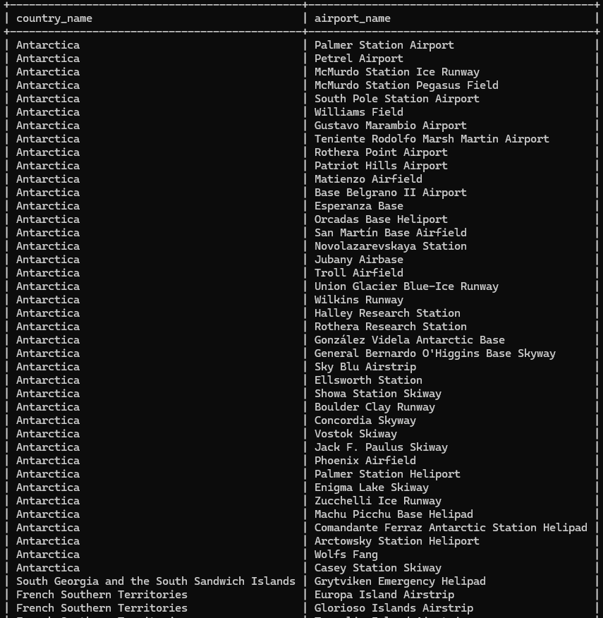

### 4
SELECT airport.elevation_ft\
FROM game\
JOIN airport on game.location = airport.ident\
WHERE screen_name='Heini';

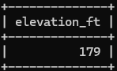

### 5
SELECT airport.elevation_ft * 0.3048 as "elevation_m"\
FROM game\
JOIN airport on game.location = airport.ident\
WHERE screen_name='Heini';

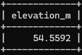

### 6
SELECT airport.name as "name"\
FROM game\
JOIN airport on game.location = airport.ident\
WHERE screen_name='Ilkka';

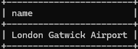

### 7
SELECT country.name as "name"\
FROM game\
JOIN airport on game.location = airport.ident\
JOIN country on airport.iso_country = country.iso_country\
WHERE screen_name='Ilkka';

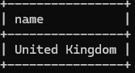

### 8
SELECT goal.name as "name"\
FROM game\
JOIN goal_reached on game.id = goal_reached.game_id\
JOIN goal on goal_reached.goal_id = goal.id\
WHERE screen_name='Heini';

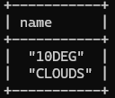

### 9
SELECT airport.name as "name"\
FROM game\
JOIN ???\
WHERE screen_name='Ilkka';

En saanut ideasta kiinni, missä saavutuksien lokaatio tallentuu.

### 10
Sama homma kun 9:ssä

## 05: Join-exercises

### 1
SELECT country.name as "country name", airport.name as "airport name"\
FROM airport\
JOIN country on airport.iso_country = country.iso_country\
WHERE scheduled_service='yes' AND country.name='Finland';

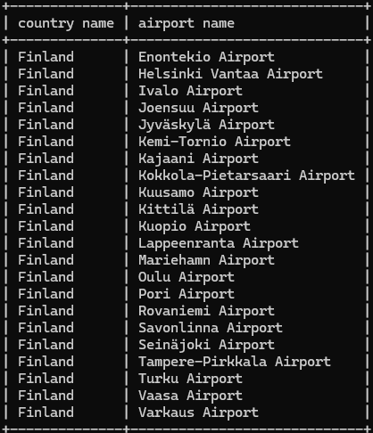

### 2
SELECT screen_name, airport.name as "name"\
FROM game\
JOIN airport on game.location = airport.ident;

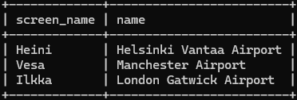

### 3
SELECT screen_name, country.name as "name"\
FROM game\
JOIN airport on game.location = airport.ident\
JOIN country on airport.iso_country = country.iso_country;

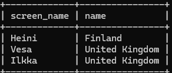

### 4
SELECT airport.name as "name", screen_name\
FROM airport\
LEFT JOIN game on game.location = airport.ident\
WHERE airport.name LIKE '%hels%'
ORDER BY screen_name DESC;

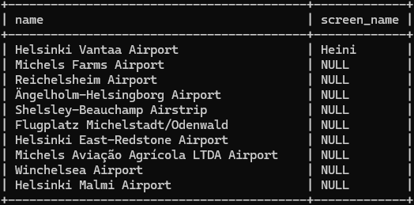

### 5
SELECT goal.name as "name", screen_name
FROM goal
LEFT JOIN goal_reached on goal.id = goal_reached.goal_id
LEFT JOIN game on goal_reached.game_id = game.id;

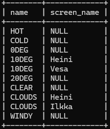

## 