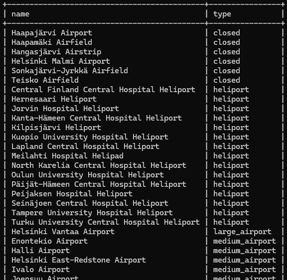
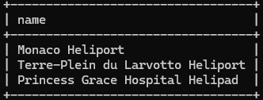
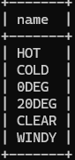
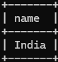

# MySQL exercises

## Sections
- [03: Single table select](#03-single-table-select)
- [04: Where clause select](#04-where-clause-select)
- [05: Join exercises](#05-join-exercises)
- [06: Join in Where clause](#06-join-in-where-clause)
- [07: Summaries (distinct, group by)](#07-summaries-distinct-group-by)
- [08: Update queries](#08-update-queries)

## 03: Single table select

### 1
SELECT * FROM goal;

### 2
SELECT name, type 
FROM airport 
WHERE iso_country='FI';

### 3
SELECT name
FROM airport
WHERE iso_country='FI'
ORDER BY name;

### 4
SELECT name, type
FROM airport
WHERE iso_country='FI'
ORDER BY type, name;

### 5
SELECT name
FROM country
WHERE name LIKE 'F%';

### 6
SELECT name
FROM country
WHERE name like '%f%';

### 7
SELECT location FROM game WHERE screen_name='Vesa';

### 8
SELECT co2_consumed FROM game WHERE screen_name='Ilkka';

### 9
SELECT DISTINCT co2_budget FROM goal;

## 04: Where-clause select

### 1
SELECT country.name as "country name", airport.name as "airport name"\
FROM country\
JOIN airport on country.iso_country = airport.iso_country\
WHERE country.name='Iceland';

### 2
SELECT airport.name as "airport name"\
FROM country\
JOIN airport on country.iso_country = airport.iso_country\
WHERE country.name='France' AND airport.type='large_airport';

### 3
SELECT country.name as "country_name", airport.name as "airport_name"\
FROM country\
JOIN airport on country.iso_country = airport.iso_country\
WHERE airport.continent='AN';

### 4
SELECT airport.elevation_ft\
FROM game\
JOIN airport on game.location = airport.ident\
WHERE screen_name='Heini';

### 5
SELECT airport.elevation_ft * 0.3048 as "elevation_m"\
FROM game\
JOIN airport on game.location = airport.ident\
WHERE screen_name='Heini';

### 6
SELECT airport.name as "name"\
FROM game\
JOIN airport on game.location = airport.ident\
WHERE screen_name='Ilkka';

### 7
SELECT country.name as "name"\
FROM game\
JOIN airport on game.location = airport.ident\
JOIN country on airport.iso_country = country.iso_country\
WHERE screen_name='Ilkka';

### 8
SELECT goal.name as "name"\
FROM game\
JOIN goal_reached on game.id = goal_reached.game_id\
JOIN goal on goal_reached.goal_id = goal.id\
WHERE screen_name='Heini';

### 9
SELECT airport.name as "name"\
FROM game\
JOIN ???\
WHERE screen_name='Ilkka';

En saanut ideasta kiinni, missä saavutuksien lokaatio tallentuu.

### 10
Sama homma kun 9:ssä

## 05: Join-exercises

### 1
SELECT country.name as "country name", airport.name as "airport name"\
FROM airport\
JOIN country on airport.iso_country = country.iso_country\
WHERE scheduled_service='yes' AND country.name='Finland';

### 2
SELECT screen_name, airport.name as "name"\
FROM game\
JOIN airport on game.location = airport.ident;

### 3
SELECT screen_name, country.name as "name"\
FROM game\
JOIN airport on game.location = airport.ident\
JOIN country on airport.iso_country = country.iso_country;

### 4
SELECT airport.name as "name", screen_name\
FROM airport\
LEFT JOIN game on game.location = airport.ident\
WHERE airport.name LIKE '%hels%'\
ORDER BY screen_name DESC;

### 5
SELECT goal.name as "name", screen_name\
FROM goal\
LEFT JOIN goal_reached on goal.id = goal_reached.goal_id\
LEFT JOIN game on goal_reached.game_id = game.id;

## 06: Join in Where clause

### 1
SELECT name\
FROM country\
WHERE iso_country in(\
    SELECT iso_country\
    FROM airport\
    WHERE name LIKE "satsuma%"\
);

### 2
SELECT name\
FROM airport\
WHERE iso_country in (\
    SELECT iso_country\
    FROM country\
    WHERE iso_country='MC'
);

### 3
SELECT screen_name\
FROM game\
WHERE id in(\
    SELECT game_id\
    FROM goal_reached\
    WHERE goal_id in(\
        SELECT id\
        FROM goal\
        WHERE target_text='Clouds'
    )\
);

### 4
SELECT name\
FROM country\
WHERE iso_country not in(\
    SELECT iso_country\
    FROM airport\
);

### 5
SELECT name\
FROM goal\
WHERE id not in(\
    SELECT goal_id\
    FROM goal_reached\
    WHERE game_id in(\
        SELECT id\
        FROM game\
        WHERE screen_name='Heini'\
    )\
);

## 07: Summaries (distinct, group by)

### 1
SELECT max(elevation_ft)\
FROM airport;

### 2
SELECT continent, COUNT(*)\
FROM country
GROUP BY continent;

Tässä pieni ongelma "NA" kohdalla, sillä tietokannan "täyttäjä" lukee datan CSV:stä, ja muuttaa kaikki NA-tyypit nolliksi. Tällöin myös string "NA" muunnetaan nollaksi.*

*

### 3
SELECT screen_name, COUNT(*)\
FROM goal_reached\
JOIN game on game.id = goal_reached.game_id\
GROUP BY screen_name;

### 4
SELECT screen_name\
FROM game\
WHERE co2_consumed in(\
    SELECT min(co2_consumed)\
    FROM game\
);

### 5
SELECT country.name as "name", count( * )\
FROM airport\
JOIN country on country.iso_country = airport.iso_country\
GROUP BY country.name\
HAVING count( * ) > 50\
ORDER BY count( * ) DESC;

### 6
SELECT country.name as "name"\
FROM airport\
JOIN country on country.iso_country = airport.iso_country\
GROUP BY country.iso_country\
HAVING count(*) > 1000;

### 7
SELECT name\
FROM airport\
WHERE elevation_ft in(\
    SELECT max(elevation_ft)\
    FROM airport\
);

### 8
SELECT country.name as "name"\
FROM airport\
JOIN country on country.iso_country = airport.iso_country\
WHERE elevation_ft in(\
    SELECT max(elevation_ft)\
    FROM airport\
);

### 9
SELECT count( * )\
FROM goal_reached\
WHERE game_id in(\
    SELECT id\
    FROM game\
    WHERE screen_name='Vesa'\
);

### 10
SELECT name\
FROM airport\
WHERE latitude_deg in(\
    SELECT min(latitude_deg)\
    FROM airport\
);

## 08: Update queries

### 1
SELECT * from game;

UPDATE game\
SET location=(
    SELECT ident\
    FROM airport\
    WHERE name='Nottingham Airport'\
), 
co2_consumed=co2_consumed+500
WHERE screen_name='Vesa';

SELECT * from game;

### 2 (multichoice question)
"
Ja nyt alustetaan oma tietokanta valmiiksi projektin kannalta. Eli poistetaan kaikki pelin tilaan liittyvä testidata. Viite-eheyden takia pystyt poistamaan datan vain fiksussa järjestyksessä.

Täytyykö sinun poistaa ensin data game-taulusta vai goal_reached taulusta?"

v: **goal_reached**

### 3
DELETE FROM goal_reached;

### 4
DELETE FROM game;