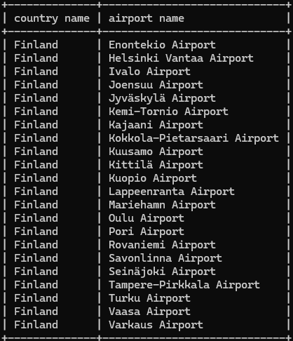
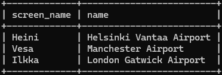
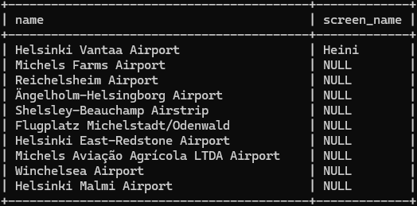

# 05: Join-exercises

### 1
```sql
SELECT country.name as "country name", airport.name as "airport name"
FROM airport
JOIN country on airport.iso_country = country.iso_country
WHERE scheduled_service='yes' AND country.name='Finland';
```



### 2
```sql
SELECT screen_name, airport.name as "name"
FROM game
JOIN airport on game.location = airport.ident;
```



### 3
```sql
SELECT screen_name, country.name as "name"
FROM game
JOIN airport on game.location = airport.ident
JOIN country on airport.iso_country = country.iso_country;
```


### 4
```sql
SELECT airport.name as "name", screen_name
FROM airport
LEFT JOIN game on game.location = airport.ident
WHERE airport.name LIKE '%hels%'
ORDER BY screen_name DESC;
```



### 5
```sql
SELECT goal.name as "name", screen_name
FROM goal
LEFT JOIN goal_reached on goal.id = goal_reached.goal_id
LEFT JOIN game on goal_reached.game_id = game.id;
```

