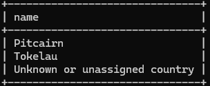

# 06: Join in Where clause

### 1
```sql
SELECT name
FROM country
WHERE iso_country in(
    SELECT iso_country
    FROM airport
    WHERE name LIKE "satsuma%"
);
```


### 2
```sql
SELECT name
FROM airport
WHERE iso_country in (
    SELECT iso_country
    FROM country
    WHERE iso_country='MC'
);
```


### 3
```sql
SELECT screen_name
FROM game
WHERE id in(
    SELECT game_id
    FROM goal_reached
    WHERE goal_id in(
        SELECT id
        FROM goal
        WHERE target_text='Clouds'
    )
);
```


### 4
```sql
SELECT name
FROM country
WHERE iso_country not in(
    SELECT iso_country
    FROM airport
);
```



### 5
```sql
SELECT name
FROM goal
WHERE id not in(
    SELECT goal_id
    FROM goal_reached
    WHERE game_id in(
        SELECT id
        FROM game
        WHERE screen_name='Heini'
    )
);
```

