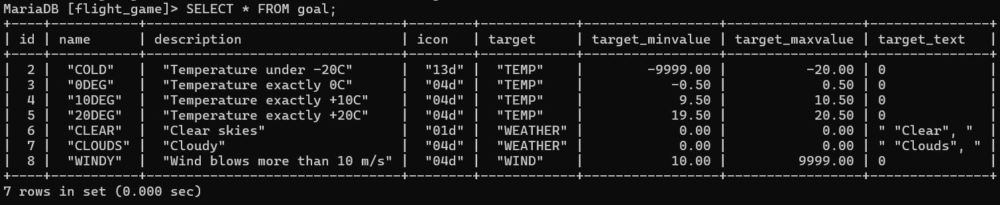
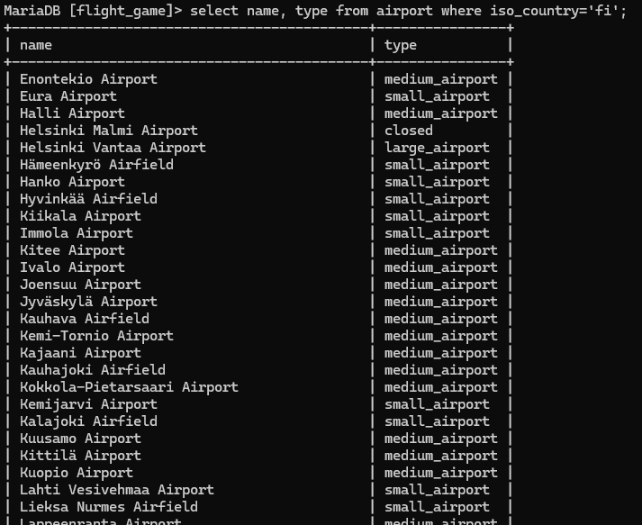
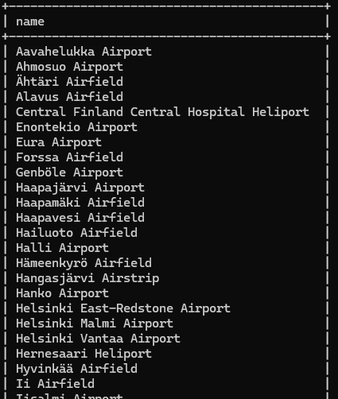
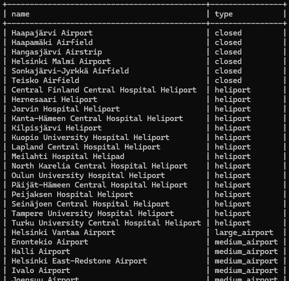
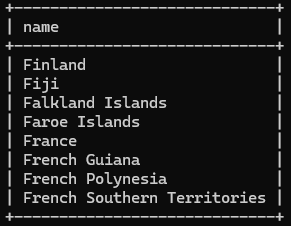
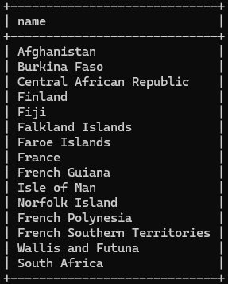
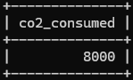

# 03: Single table select

### 1
```sql
SELECT * FROM goal;
```



### 2
```sql
SELECT name, type 
FROM airport 
WHERE iso_country='FI';
```



### 3
```sql
SELECT name
FROM airport
WHERE iso_country='FI'
ORDER BY name;
```



### 4
```sql
SELECT name, type
FROM airport
WHERE iso_country='FI'
ORDER BY type, name;
```



### 5
```sql
SELECT name
FROM country
WHERE name LIKE 'F%';
```



### 6
```sql
SELECT name
FROM country
WHERE name like '%f%';
```



### 7
```sql
SELECT location FROM game WHERE screen_name='Vesa';
```


### 8
```sql
SELECT co2_consumed FROM game WHERE screen_name='Ilkka';
```



### 9
```sql
SELECT DISTINCT co2_budget FROM goal;
```

