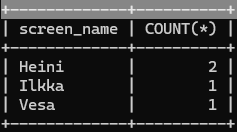
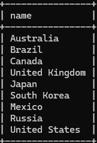
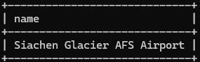

# 07: Summaries (distinct, group by)

### 1
```sql
SELECT max(elevation_ft)
FROM airport;
```


### 2
```sql
SELECT continent, COUNT(*)
FROM country
GROUP BY continent;
```

Tässä pieni ongelma "NA" kohdalla, sillä tietokannan "täyttäjä" lukee datan CSV:stä, ja muuttaa kaikki NA-tyypit nolliksi. Tällöin myös string "NA" muunnetaan nollaksi.*

*

### 3
```sql
SELECT screen_name, COUNT(*)
FROM goal_reached
JOIN game on game.id = goal_reached.game_id
GROUP BY screen_name;
```



### 4
```sql
SELECT screen_name
FROM game
WHERE co2_consumed in(
    SELECT min(co2_consumed)
    FROM game
);
```


### 5
```sql
SELECT country.name as "name", count( * )
FROM airport
JOIN country on country.iso_country = airport.iso_country
GROUP BY country.name
HAVING count( * ) > 50
ORDER BY count( * ) DESC;
```


### 6
```sql
SELECT country.name as "name"
FROM airport
JOIN country on country.iso_country = airport.iso_country
GROUP BY country.iso_country
HAVING count(*) > 1000;
```



### 7
```sql
SELECT name
FROM airport
WHERE elevation_ft in(
    SELECT max(elevation_ft)
    FROM airport
);
```



### 8
```sql
SELECT country.name as "name"
FROM airport
JOIN country on country.iso_country = airport.iso_country
WHERE elevation_ft in(
    SELECT max(elevation_ft)
    FROM airport
);
```


### 9
```sql
SELECT count(*)
FROM goal_reached
WHERE game_id in(
    SELECT id
    FROM game
    WHERE screen_name='Vesa'
);
```


### 10
```sql
SELECT name
FROM airport
WHERE latitude_deg in(
    SELECT min(latitude_deg)
    FROM airport
);
```

