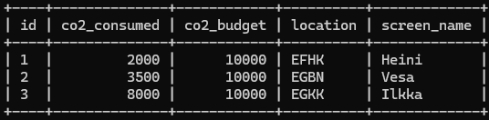

# 08: Update queries

### 1
```sql
SELECT * from game;

UPDATE game
SET location=(
    SELECT ident
    FROM airport
    WHERE name='Nottingham Airport'
), 
co2_consumed=co2_consumed+500
WHERE screen_name='Vesa';

SELECT * from game;
```



### 2 (multichoice question)
"
Ja nyt alustetaan oma tietokanta valmiiksi projektin kannalta. Eli poistetaan kaikki pelin tilaan liittyvä testidata. Viite-eheyden takia pystyt poistamaan datan vain fiksussa järjestyksessä.

Täytyykö sinun poistaa ensin data game-taulusta vai goal_reached taulusta?"

v: **goal_reached**

### 3
```sql
DELETE FROM goal_reached;
```

### 4
```sql
DELETE FROM game;
```