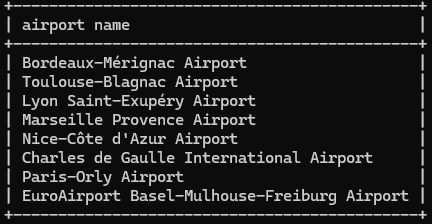
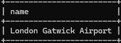

# 04: Where-clause select

### 1
```sql
SELECT country.name as "country name", airport.name as "airport name"
FROM country
JOIN airport on country.iso_country = airport.iso_country
WHERE country.name='Iceland';
```


### 2
```sql
SELECT airport.name as "airport name"
FROM country
JOIN airport on country.iso_country = airport.iso_country
WHERE country.name='France' AND airport.type='large_airport';
```



### 3
```sql
SELECT country.name as "country_name", airport.name as "airport_name"
FROM country
JOIN airport on country.iso_country = airport.iso_country
WHERE airport.continent='AN';
```


### 4
```sql
SELECT airport.elevation_ft
FROM game
JOIN airport on game.location = airport.ident
WHERE screen_name='Heini';
```


### 5
```sql
SELECT airport.elevation_ft * 0.3048 as "elevation_m"
FROM game
JOIN airport on game.location = airport.ident
WHERE screen_name='Heini';
```


### 6
```sql
SELECT airport.name as "name"
FROM game
JOIN airport on game.location = airport.ident
WHERE screen_name='Ilkka';
```



### 7
```sql
SELECT country.name as "name"
FROM game
JOIN airport on game.location = airport.ident
JOIN country on airport.iso_country = country.iso_country
WHERE screen_name='Ilkka';
```


### 8
```sql
SELECT goal.name as "name"
FROM game
JOIN goal_reached on game.id = goal_reached.game_id
JOIN goal on goal_reached.goal_id = goal.id
WHERE screen_name='Heini';
```


### 9
```sql
-- TODO
SELECT airport.name as "name"
FROM game
JOIN ???
WHERE screen_name='Ilkka';
```

En saanut ideasta kiinni, mistä saavutuksien lokaatio tulisi repiä

### 10
Sama homma kun 9:ssä